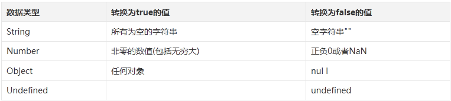

# 零碎知识点集合
> 有的知识点不适合单独拿出来写文章，但是又比较重要，需要记录下来，就放在这里了。

## JavaScript
### 1. Boolean

既然非零的数值都能转换为true，为什么`1 == true`为true，`2 == true`为false呢？  

因为两个不等的类型进行比较时，会发生类型转换。  此时true转化为1了。
也可以用`Boolen(2) == true`进行比较。

### 2. 五种基本数据类型
* Undefined
* Null
* Boolean
* Number
* String

### 3. 创建对象
* 工厂模式；缺点是每次都要返回一个对象，并且不能确定对象类型；

* 构造函数模式：通过this来构造，缺点是创建一个对象就要创建一次方法，解决方案是在构造函数中调用全局函数，缺点是全局函数没有封装；

* 原型模式：通过prototype来创建对象的属性和方法，缺点是所有的对象共享属性和方法；

* 组合使用构造函数模式和原型模式：构造函数模式用于定义实例属性，而原型模式用于定义方法和共享属性；是定义引用类型的默认模式；

* 动态原型模式、寄生构造函数模式、稳妥构造函数……

### 4. 继承
**1. 原型链**：原理：创建一个构造函数甲，再创建一个构造函数乙，然后让乙的原型对象等于甲的一个实例，这样通过乙构造的对象就继承了甲的方法和属性。

举例：

	  function A(){
	
	  }
	  function B(){
	
	  }
	  B.prototype = new A();
	  var t = new B();
此时t同时有构造函数A和B的方法和属性。

所有引用类型都默认继承Object，所以上面的A也默认继承了Object的实例。

这种继承关系形成了原型链。

原型链继承的两个问题：

* 属性共享；

* 子类型创建时不能向超类型构造函数传递参数

**2. 借用构造函数**：基本思想：在子类型构造函数的内部调用超类型构造函数。
看下一个小知识点：apply()和call()实现借用构造函数继承。

优点：子类型构造函数可以向超类型构造函数传递参数。

缺点：和构造函数创建对象的缺点一样，函数不能复用。

**3. 组合继承**：**使用原型链实现对原型属性和方法的继承，借用构造函数实现对实例属性的继承。**

**4. 其他**：原型式继承、寄生式继承、寄生组合式继承……

### 5. apply()和call()
通俗一点讲：
现在有一个构造函数Person：

	function Person(name,age) {
		this.name=name; 
		this.age=age;
	} 
还有一个构造函数Student，Student需要继承Person的name和age属性，要么自己重新写一个，要么使用apply()或者call()来继承：

	functionStudent(name,age,grade) {
		Person.apply(this,arguments); 
		this.grade=grade;
	} 
可以看到，function.apply(参数1，参数2)中function是被继承的构造函数，参数1是指向当前构造函数的this，argument是参数。

意思就是把调用构造函数Person的对象的this传给构造函数Person，同时传递参数，并获取构造函数的属性。

call()的作用类似于apply()，只不过apply第二个参数是一个数组，而call是一串参数：Person.call(this,name,age);

### 6. 获取对象属性
在对象obj={age:21}中，如果想查看属性age有两种方式：  
1. obj.age   
2. obj["age"]

首先："."直接访问对应属性，然后[]可以按变量访问或者按字符串访问。

不加""的时候，[]就是按变量访问，此时obj[age]里面age是一个变量，而age是undefined，所以obj[age]=undefined。  
（声明一个变量a = "age"，此时obj[a]=21，这就是按变量访问。）

加了""的时候，[]就是按字符串访问，此时obj["age"]获取obj对象的age属性。

在for(key in obj)循环中，不能用obj[key]获取age属性，是因为此时key是一个变量。所以也不能用obj["key"]获取属性，正确的做法是obj[key]。

## Node

## HTML&CSS
### 1. iframe
优点：方便重复使用，例如导航；
	
缺点：

* 会产生很多界面，不利于管理；
* 不利于SEO；
* 增加HTTP请求和内存消耗；
* 多个滚动条；
* 调用外部页面,需要额外调用css,给页面带来额外的请求次数。

通过修改document.domain（只能从子域名提升到父域名）实现有相同父域名的域名间的跨域。

### 2. 三栏式布局
1. 流体布局
2. BFC布局
3. 双飞翼布局
4. 圣杯布局
5. FLEX布局
6. Table布局
7. 绝对定位布局

## 其他
### Native&Web&Hybrid
**Native APP**：原生应用。   
为某种操作系统开发的软件，可以直接在终端上运行。

优点：   
1. 可访问手机所有功能；  
2. 速度快、性能高；  
3. 可线下使用；  
4. 支持大量图形和动画；  
5. 应用下载能盈利。  

缺点：  
1. 开发成本高；  
2. 支持设备有限；  
3. 上线时间不确定；  
4. 更新要重新下载。

**Web APP**：Web应用。  
本质上是为移动浏览器设计的基于Web的应用，它们是用普通Web开发语言开发的，可以在各种智能手机浏览器上运行。

优点：  
1. 支持设备广泛；
2. 开发成本较低；
3. 可随时上线；
4. 无需用户更新。

缺点：  
1. 表现效果略差；
2. 用户体验相对低；
3. 要求联网；
4. 无法通过下载盈利；
5. 难以访问手机本身的功能。

**Hybrid APP**：混合应用。  
原生应用和Web应用的结合体，采用了原生应用的一部分、Web应用的一部分，所以必须在部分在设备上运行、部分在Web上运行。

优点：  
1. 兼容多平台；
2. 顺利访问手机多种功能；
3. 可下载；
4. 可线下使用。

缺点：  
1. 不确定上线时间；
2. 用户体验低于本地应用；
3. 性能稍慢。 