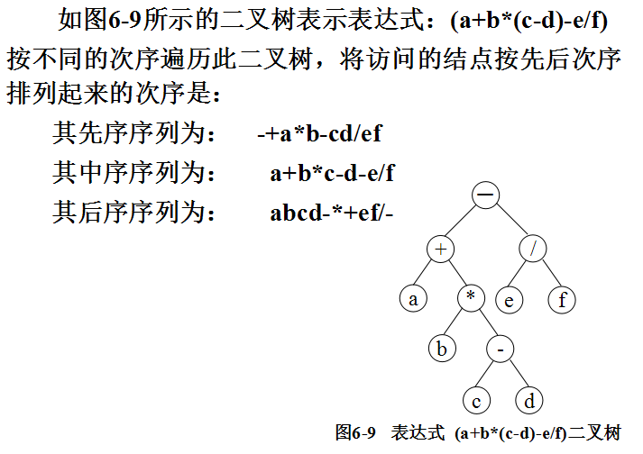
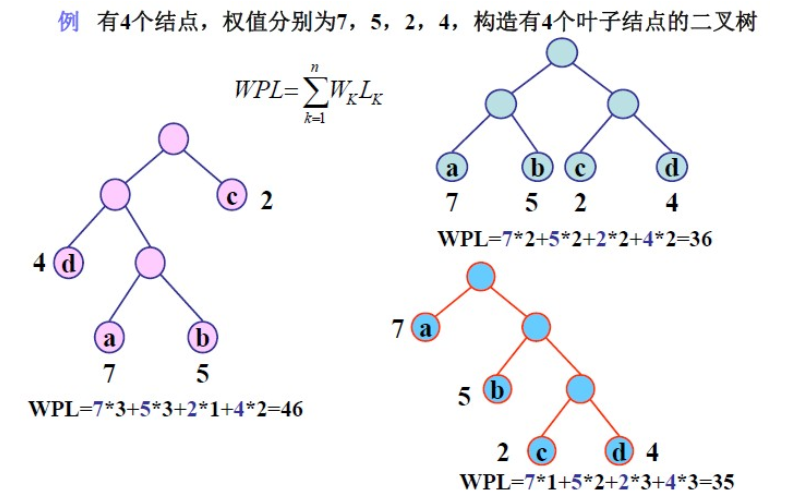
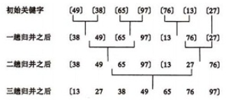

# 数据结构和算法
> 介绍最基础的数据结构和常用的算法。

## 1. 数据结构
### 1.1 链表
单向链表用通俗的话来表述就是，一个数据节点分两块，一块是用来保存数据的，另一块是用来指向下一个节点的。

在JS中，数组本来就不需要定义固定的长度，需药添加元素只要append操作，需药插入元素只要splice操作。

但是数组的效率比较慢，有些情况可以用链表代替数组。

我们先创建这个数据节点Node：

	function Node(element){
		this.element = element;
		this.next = null;
	}
有了这个节点，我们还需要一个方法对它进行操作：
	
	function List（）{
		this.head = new Node('head');
		this.find = find;
		this.insert = insert;
		this.display = display;
	}
这个方法有一个属性为head，初始化head为head。其他的find、insert、display都是方法。

List方法用来初始化链表。

完整代码：

	function Node(element){
	    this.element = element;
	    this.next = null;
	}
	
	function LList(){
	    this.head = new Node('head');
	    this.find = find;
	    this.insert = insert;
	    //this.remove = remove;
	    this.display = display;
	}
	
	function find(item){
	    var currNode = this.head;
	    while (currNode.element != item){
	        currNode = currNode.next;
	    }
	    return currNode;
	}
	
	//插入一个元素
	function insert(newElement, item){
	    var newNode = new Node(newElement);
	    var current = this.find(item);
	    newNode.next = current.next;
	    current.next = newNode;
	}
	
	function display(){
	    var currNode = this.head;
	    while (!(currNode.next == null)){
	        document.write(currNode.next.element + '&nbsp;');
	        currNode = currNode.next;
	    }
	}
	
	
	//测试程序
	var cities = new LList();
	cities.insert("Conway", "head");
	cities.insert("Russellville", "Conway");
	cities.insert("Alma", "Russellville");
	cities.display();

所谓的循环链表就是最后一个节点的next不为bull，而是指向第一个节点。

那么双向链表则是除了next，还有一个preview指向前一个节点。

双向循环链表就是综合前两者。

### 1.2 树和二叉树
树：以分支关系定义的层次结构。

二叉树：
1. 满二叉树：深度为k且有2^k-1个节点的二叉树；
2. 完全二叉树：完全符合自上而下、自左至右的二叉树。

遍历二叉树：

1. 先序遍历；
2. 中序遍历；
3. 后序遍历。

先序遍历：
若二叉树为空，则遍历结束，否则：

1. 访问根节点；
2. 先序遍历左子树；
3. 先序遍历右子树。

中序遍历：
若二叉树为空，则遍历结束，否则：

1. 中序遍历左子树；
2. 访问根节点；
3. 中序遍历右子树。

后序遍历：
若二叉树为空，则遍历结束，否则：

1. 后序遍历左子树；
2. 后续遍历右子树；
3. 访问根节点。

---

**Huffman树（最优二叉树）**

具有n个叶子结点(每个结点的权值为wi) 的二叉树不止一棵，但在所有的这些二叉树中，必定存在一棵WPL值最小的树，称这棵树为Huffman树(或称最优树) 。

WPL：树中所有叶子结点的带权路径长度之和。

构建Huffman树：
首先给一串数据从小到大排序，然后取出最小的两个树作为根节点的左右子树，左子树小于右字数，根节点等于左右子树之和。然后拿根节点去比较第三个数，依次构造二叉树，最后得到Huffman树。

Huffman树的主要作用是给字符编码。

## 2. 算法
### 2.1 排序算法
#### 2.1.1 冒泡排序
前一个值与后一个值比较，如果小于后一个值则交换。每次比较后该轮比较的最后一个值一定是该轮中最大的，不需要参加后面的比较。

	  let arr = [1,5,2,8,4,5,9,16,7,43,23,76];
	  let len = arr.length;
	  for(let i = 0;i < len - 1; i++){
	    for(let j = 0;j < len - 1 - i;j++){
	      if(arr[j] > arr[j + 1]){
	        [ arr[j],arr[j+1] ] = [ arr[j+1],arr[j] ];
	      }
	    }
	  }
	  console.log(arr);

#### 2.1.2 选择排序
初始时在序列中找到最小（大）元素，放到序列的起始位置作为已排序序列；然后，再从剩余未排序元素中继续寻找最小（大）元素，放到已排序序列的末尾。以此类推，直到所有元素均排序完毕。

	  let arr = [1,5,2,8,4,5,9,16,7,43,23,76];
	  let len = arr.length;
	  let min;
	  for(let i = 0;i < len - 1;i++){
	    min = i;
	    for(let j = i + 1;j < len;j++){
	      if(arr[j] < arr[min]){
	        min = j;
	      }
	    }
	    if(min != i){
	      [arr[min],arr[i]] = [arr[i],arr[min]];
	    }
	  }
	  console.log(arr);

#### 2.1.3 插入排序
**1. 直接插入排序**

想象一下打牌的时候，抽一张牌放到已经排好序的牌组里面。这就是插入排序。

1. 从第一个元素开始，该元素可以认为已经被排序
2. 取出下一个元素，在已经排序的元素序列中从后向前扫描
3. 如果该元素（已排序）大于新元素，将该元素移到下一位置
4. 重复步骤3，直到找到已排序的元素小于或者等于新元素的位置
5. 将新元素插入到该位置后
6. 重复步骤2~5     

把get想象成抽到的那张牌：

	  let arr = [1,5,2,8,4,5,9,16,7,43,23,76];
	  let len = arr.length;
	  let get,i,j;
	  for(i = 1;i < len;i++){
	    get = arr[i];
	    j = i - 1;
	    while(j >= 0 && arr[j] > get){
	      arr[j+1] = arr[j];
	      j--;
	    }
	    arr[j+1] = get;
	  }
	  console.log(arr);

**2. 二分查找插入排序**

对于插入排序，我们需要给get找到他合适的位置，上面的代码是从大到小一个个查找的。使用二分查找可以优化查找的过程。

	  let arr = [1,5,2,8,4,5,9,16,7,43,23,76];
	  let len = arr.length;
	  let get,i,j;
	  let left,right,middle;
	
	  for(i = 1;i < len;i++){
	    get = arr[i];
	    left = 0;
	    right = i - 1;
	    while(left <= right){
	      middle = Math.floor((left + right) / 2);
	      if(arr[middle] > get){
	        right = middle - 1;
	      }
	      else{
	        left = middle + 1;
	      }
	    }
	    for(j = i - 1;j >= left;j--){
	      arr[j+1] = arr[j];
	    }
	    arr[left] = get;
	  }
	  console.log(arr);

**3. 希尔排序**

希尔排序通过将比较的全部元素分为几个区域来提升插入排序的性能。这样可以让一个元素可以一次性地朝最终位置前进一大步。然后算法再取越来越小的步长进行排序，算法的最后一步就是普通的插入排序，但是到了这步，需排序的数据几乎是已排好的了（此时插入排序较快）。

#### 2.1.4 归并排序
将两个或两个以上的有序列表合成一个新的有序列表，不断合成，最后只剩一个有序列表。

#### 2.1.5 快速排序

数组中，取索引位于中间的数，作为基准。然后把比基准小的数扔左边，比基准大的数扔右边，处理完之后再划分左边和右边，当分区的大小是0或者1时，整体就已经排好序了。

	  function partition(arr,left,right){
	    let pivot = arr[right];
	    let tail = left - 1;
		//这一步是把小于基准的数全部扔到左边
	    for(let i = left;i < right;i++){
	      if(arr[i] <= pivot){
	        tail++;
	        [arr[tail],arr[i]] = [arr[i],arr[tail]];
	      }
	    }
		//此时左边全是小于基准的数，那么把基准那个数扔到左边最大索引+1的位置
	    [arr[tail+1],arr[right]] = [arr[right],arr[tail+1]];
	    return tail + 1;
	  }
	  
	  function quickSort(arr,left,right){
	    let index;
	    if(left < right){
	      index = partition(arr,left,right);
		  //index-1是因为索引为index的数是左边这一块的最大值，不需要继续比较
	      quickSort(arr,left,index - 1);
		  //index+1是因为此时index是左边最大值，我们需要从右边最小值开始递归
	      quickSort(arr,index + 1,right);
	    }
	  }
	
	  let arr = [1,5,2,8,4,5,9,16,7,43,23,76];
	  let len = arr.length;
	  quickSort(arr,0,len-1);
	  console.log(arr);

#### 2.1.6 时间复杂度

上述算法中，除了希尔排序和快速排序，其他时间复杂度都为O(n^2)，希尔排序为O(n^1.3)，快速排序为O(nlog2N)。（快排的log2N中2是底数）。

### 2.2 BFS和DFS

BFS（广度优先搜索算法）和DFS（深度优先搜索算法）都是用于图中的搜索。从某个点开始，不停的搜索与它相连或间接相连的点，直到全部搜索到。

BFS是有分层次的，一层层的搜索，而DFS正好相反。

上图中，按照BFS，则搜索路径为（假设点1为V0）：

1 -> 2,1 ->5  
2 -> 3  
5 -> 4  
4 -> 6  
搜索结束

而按照DFS的话，则是

1 -> 2  
2 -> 3  
3 -> 4  
4 -> 5  
5回溯到4  
4 ->6  
搜索结束

优缺点：

BFS：适用于最短路问题，而且寻找深度小，但缺点是内存耗费量大（需要开大量的数组单元用来存储状态）。

DFS：适用于遍历问题，对于问题搜索深度小的时候处理速度迅速，然而在深度很大的情况下效率不高

### 2.3 最短路算法
#### 2.3.1 Dijkstra算法

其实理论上很简单，就是一个贪心策略：

从起始点开始，判断相连的点的距离，选择距离最短的相连点。

#### 2.3.2 Floyd算法

通过一个图的权值矩阵求出它的每两点间的最短路径矩阵。