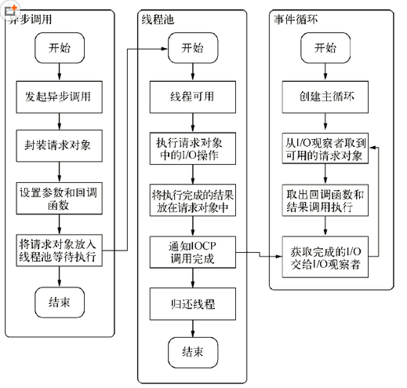

# 深入浅出Node.js——异步I/O
> Node是首个将异步作为主要编程方式和设计理念的高级编程语言。

## 为什么要异步
### 用户体验
JavaScript是单线程的，并且和UI渲染共用一个线程。这就意味着当JavaScript执行时，UI渲染和响应处于停滞状态。  
若果脚本执行时间超过100毫秒，用户就会感觉到页面卡顿。如果网页需要获取一个网络资源，采用同步的方式，那么JavaScript需要等待资源完全从服务器获取后才能继续执行，这个期间UI渲染和响应都会停顿。   
同步方式使得用户体验极差，所以不许采用异步，在下载资源期间，JavaScript和UI的执行都不会处于等待状态，也可以响应用户的交互行为。

前端通过异步可以消除UI阻塞现象，但**前端获取资源的速度也取决于后端的响应速度**。

#### 同步获取资源：

	//消费时间为M
	getData('formdb');
	//消费时间为N
	getData('form_remote_api');
	//总时间为M+N

#### 异步获取资源：

	getData('form_db',function(result){
		//消费时间为M
	});
	getData('form_remote_api',function(result){
		//消费时间为N
	})
	//总时间为max(M,N)

随着应用复杂性增加，同步或异步事件会越来越多，那么(N+M+……)和max(M,N,……)时间上就有很大的差异了。

只有后端能够快速的响应资源，才能让前端的体验变好。

### 资源分配
主流的资源分配执行任务方法有两种：

1. 单线程串行依次执行
2. 多线程并行完成

单线程优点：符合编程人员按顺序思考的思维方式，易于表达。  
单线程缺点：**同步编程模型会因阻塞I/O导致硬件资源得不到更优的使用。**

多线程优点：在多核CPU上能有效提升CPU的利用率。  
多线程缺点：**有死锁、状态同步等问题。**

Node异步方案：**利用单线程，远离多线程死锁、状态同步等问题；利用异步I/O，让单线程远离阻塞，以更好的使用CPU。**

为了弥补单线程无法利用多核CPU的缺点，Node提供了类似前端浏览器中Web Workers的子进程，该子进程可以通过工作进程高效的利用CPU和I/O。

## 异步I/O实现现状

### 异步I/O和非阻塞I/O
异步/同步，阻塞/非阻塞听起来很像，但实际上操作系统内核对于I/O只有两种方式：**阻塞/非阻塞**。

阻塞和非阻塞远离很简单，值得一提的是，非阻塞调用时，立即返回的不是业务层期望的数据，而仅仅是当前调用的状态。  
为了获取完整的数据，应用程序需要重复调用I/O操作来确认是否完成。这种重复调用判断操作是否完成的技术叫做**轮询**。

**我们时常提到Node是单线程的，这里的单线程仅仅是JavaScript执行在单线程中罢了，在Node中，无论是什么平台，内部完成I/O任务的另有线程池！**  
**我们时常提到Node是单线程的，这里的单线程仅仅是JavaScript执行在单线程中罢了，在Node中，无论是什么平台，内部完成I/O任务的另有线程池！**  
**我们时常提到Node是单线程的，这里的单线程仅仅是JavaScript执行在单线程中罢了，在Node中，无论是什么平台，内部完成I/O任务的另有线程池！**

看到这里的时候我内心是崩溃的。但是还是来分析一下为什么要用到线程池吧：罪魁祸首——**轮询**。

在最理想的状况下，线程非阻塞调用系统内核，然后立即返回。当系统内核事件处理完毕时，返回给线程一个信号（或者直接返回数据），线程接受到信号后去接受系统内核给的数据。  
这种理所当然的机制是无法实现的！！  
**线程需要浪费时间在轮询上，也就是不停的调用之前调用过的系统内核，判断事件是否完成，这本质上就是同步**

解决办法：**使用线程池模拟异步I/O**  
让部分线程进行轮询，让一个进程进行计算处理，通过线程之间的通信将I/O得到的数据进行传递。这是一种模拟异步I/O的方式。

## Node的异步I/O
这个书上讲的有点复杂，我简单的概况一下吧……  
Node异步I/O模型的基本要素:**事件循环、观察者、请求对象、I/O线程池**。

**事件循环**：不停的创建一个循环，判断是否存在事件，如果有，则取出一个事件，判断是否有关联的回调，如果有，让JavaScript执行回调。如果没有，继续判断有没有事件。每一次循环称为一个Tick。  

**观察者**：用来判断是否存在事件。

**请求对象**：Node自身其实是多线程的，而其中的JavaScript执行时单线程的。当JavaScript发起调用到内核完成I/O操作的过程中存在一个中间产物。JavaScript在调用中，实际上调用到Node的核心模块就跟这个调用暂时说拜拜了，接下来的事情都是由中间生产的请求对象处理的。请求对象被线程池中空出来的线程调用。I/O操作调用完毕后，会通知IOCP（Windows下实现异步的一个机制），让它将完成的I/O交给观察者。

**I/O线程池**：执行I/O操作。 

如果没看懂，上图：  

## 非I/O的异步API
一共四个：`setTimeout()、setInterval()、setImmediate()、process.nextTick()`。

### 定时器
setTimeout()和setInterval()与浏览器中的API是一致的。具体怎么实现就不说了……  

定时器的问题在于：**它并非精确的(但在容忍范围之内)**。尽管事件循环非常快，但如果某一次循环占用的时间比较多，那么下次循环时，它也许已经超时很久了。  
例如：通过setTimeout()设定一个任务在10毫秒后执行，但在9毫秒后，有一个任务占用了5毫秒的CPU时间，再次轮到定时器执行时，已经过期4毫秒。

### process.nextTick()
用于立即执行一个异步任务，比`setTimeout(function(){},0);`好用，节省性能。

### setImmediate()
作用效果类似于process.nextTick()，优先级在process.nextTick()后。

## 事件驱动与高性能服务器
从事件循环上能够看出事件驱动的实质：**通过主循环加事件触发的方式来运行程序**。

##总结
事件循环时异步实现的核心，它与浏览器中的执行模型基本保持了一致。Node正是依靠构建了一套完善的高性能异步I/O框架，打破了JavaScript在服务器端止步不前的局面。