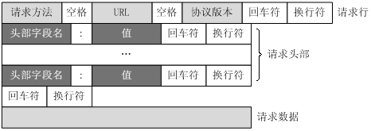

# HTTP学习（二）
> HTTP学习（一）中讲解了HTTP协议发展的过程和TCP协议的握手挥手。本文详细叙述HTTP协议内容，绝大多数内容是复制粘贴。

## 请求方法
根据HTTP标准，HTTP请求可以使用多种请求方法。  

HTTP1.0定义了三种请求方法： GET, POST 和 HEAD方法。  
HTTP1.1新增了五种请求方法：OPTIONS, PUT, DELETE, TRACE 和 CONNECT 方法。  

**GET**     请求指定的页面信息，并返回实体主体。  

**HEAD**     类似于get请求，只不过返回的响应中没有具体的内容，用于获取报头  

**POST**     向指定资源提交数据进行处理请求（例如提交表单或者上传文件）。数据被包含在请求体中。POST请求可能会导致新的资源的建立和/或已有资源的修改。  

**PUT**     从客户端向服务器传送的数据取代指定的文档的内容。  

**DELETE**      请求服务器删除指定的页面。  

**CONNECT**     HTTP/1.1协议中预留给能够将连接改为管道方式的代理服务器。 
 
**OPTIONS**     允许客户端查看服务器的性能。  

**TRACE**     回显服务器收到的请求，主要用于测试或诊断。  

### GET和POST请求
GET请求

	GET /books/?sex=man&name=Professional HTTP/1.1
	Host: www.wrox.com
	User-Agent: Mozilla/5.0 (Windows; U; Windows NT 5.1; en-US; rv:1.7.6)
	Gecko/20050225 Firefox/1.0.1
	Connection: Keep-Alive

注意最后一行是空行  

POST请求

	POST / HTTP/1.1
	Host: www.wrox.com
	User-Agent: Mozilla/5.0 (Windows; U; Windows NT 5.1; en-US; rv:1.7.6)
	Gecko/20050225 Firefox/1.0.1
	Content-Type: application/x-www-form-urlencoded
	Content-Length: 40
	Connection: Keep-Alive
	
	name=Professional%20Ajax&publisher=Wiley

GET和POST区别：

1. GET提交的数据会放在URL之后，以?分割URL和传输数据，参数之间以&相连，如EditPosts.aspx?name=test1&id=123456. POST方法是把提交的数据放在HTTP包的Body中；

2. GET提交的数据大小有限制（因为浏览器对URL的长度有限制），而POST方法提交的数据没有限制；

3. GET方式需要使用Request.QueryString来取得变量的值，而POST方式通过Request.Form来获取变量的值；

4. GET方式提交数据，会带来安全问题，比如一个登录页面，通过GET方式提交数据时，用户名和密码将出现在URL上，如果页面可以被缓存或者其他人可以访问这台机器，就可以从历史记录获得该用户的账号和密码。

## 请求消息 Request
请求消息：请求行（request line）、请求头部（header）、空行和请求数据四个部分组成。

第一部分：请求行，用来说明请求类型,要访问的资源以及所使用的HTTP版本;  

第二部分：请求头部，紧接着请求行（即第一行）之后的部分，用来说明服务器要使用的附加信息;  

第三部分：空行，请求头部后面的空行是必须的;  

第四部分：请求数据也叫主体，可以添加任意的其他数据。  

具体实例可以通过控制台查看，也可以看上面的GET的POST请求实例（GET和POST的请求消息是不同的）。

## 响应消息 Response
响应消息：状态行、消息报头、空行和响应正文。

第一部分：状态行，由HTTP协议版本号， 状态码， 状态消息 三部分组成；  
第一行为状态行，（HTTP/1.1）表明HTTP版本为1.1版本，状态码为200，状态消息为（ok）。

第二部分：消息报头，用来说明客户端要使用的一些附加信息；  
Date:生成响应的日期和时间；Content-Type:指定了MIME类型的HTML(text/html),编码类型是UTF-8。

第三部分：空行，消息报头后面的空行是必须的；

第四部分：响应正文，服务器返回给客户端的文本信息。

## 状态码

状态代码由三位数字组成，第一个数字定义了响应的类别，共分五种类别:
	
	1xx：指示信息--表示请求已接收，继续处理
	2xx：成功--表示请求已被成功接收、理解、接受
	3xx：重定向--要完成请求必须进行更进一步的操作
	4xx：客户端错误--请求有语法错误或请求无法实现
	5xx：服务器端错误--服务器未能实现合法的请求

常见状态码：

	200 OK                        //客户端请求成功
	400 Bad Request               //客户端请求有语法错误，不能被服务器所理解
	401 Unauthorized              //请求未经授权，这个状态代码必须和WWW-Authenticate报头域一起使用 
	403 Forbidden                 //服务器收到请求，但是拒绝提供服务
	404 Not Found                 //请求资源不存在，eg：输入了错误的URL
	500 Internal Server Error     //服务器发生不可预期的错误
	503 Server Unavailable        //服务器当前不能处理客户端的请求，一段时间后可能恢复正常