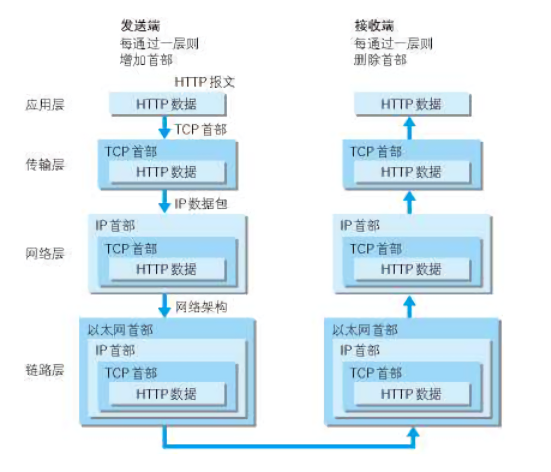
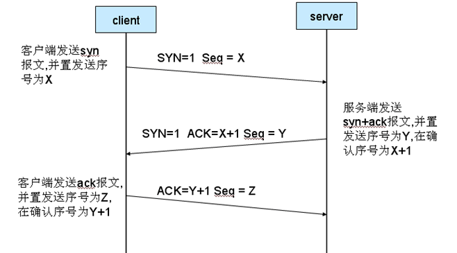
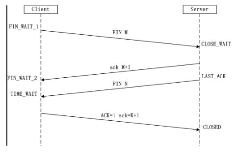

# HTTP学习（一）
> 几个月前看完了《图解HTTP》，但是没有做笔记，现在需要把HTTP系统的整理一遍。《图解HTTP》这本书已经有些过时（虽然用的是最新版），比如书上写着HTTP现在用的是1.1，而实际上我们已经开始使用HTTP/2了。所以许多细节需要求证、更新。

## HTTP简介
**概念**：HTTP协议是Hyper Text Transfer Protocol（超文本传输协议）的缩写,是用于从万维网（WWW:World Wide Web ）服务器传输超文本到本地浏览器的传送协议。

### 版本
**HTTP/0.9**:只有GET命令，服务器只回应HTML格式字符串。  

**HTTP/1.0**:

	服务器可发送任何格式内容（图像、视频、二进制文件），
	引入POST和HEAD命令，
	HTTP请求必须加上HTTP header，
	增加状态码、多字符集支持、多部分发送、权限、缓存、内容编码，
	请求和回应格式改变，不具体写了。
缺点：每个TCP连接只能发送一个请求。发送数据完毕后，连接关闭。如果需要请求其他资源，需要再新建一个连接。

**HTTP/1.1**:

	持久连接：TCP连接默认不关闭。对于同一个域名，大多数浏览器允许同时建立6个持久连接。
	管道机制：同一个TCP连接里面，客户端可以同时发送多个请求。这样就进一步改进了HTTP协议的效率。
	Content-Length字段：区分数据包属于哪一个回应。
	分块传输编码：使用Content-Length（分块发送），而不使用Content-Length（一次性发送）。
	其他：增加PUT、PATCH、OPTIONS、DELETE等方法，增加HOST字段指定服务器域名。

缺点：虽然1.1版允许复用TCP连接，但是同一个TCP连接里面，所有的数据通信是按次序进行的。服务器只有处理完一个回应，才会进行下一个回应。要是前面的回应特别慢，后面就会有许多请求排队等着。这称为"队头堵塞"  

解决方法：一是减少请求数，二是同时多开持久连接。

**HTTP/2**:
HTTP/2不叫2.0，没有子版本。它继承于谷歌自行研发的SPDY协议，于2015年发布。
	
1. **二进制协议**：头信息和数据体都是二进制，并且统称为"帧"（frame）：头信息帧和数据帧。好处是可以定义额外的帧，为以后高级应用打基础。  

2. **多工**：在一个TCP连接里，客户端和浏览器都可以同时发送多个请求或回应，而且不用按照顺序一一对应，这样就避免了"队头堵塞"。  
举例来说，在一个TCP连接里面，服务器同时收到了A请求和B请求，于是先回应A请求，结果发现处理过程非常耗时，于是就发送A请求已经处理好的部分， 接着回应B请求，完成后，再发送A请求剩下的部分。  

3. **数据流**：因为 HTTP/2 的数据包是不按顺序发送的，同一个连接里面连续的数据包，可能属于不同的回应。因此，必须要对数据包做标记，指出它属于哪个回应。客户端发出的数据流，ID一律为奇数，服务器发出的，ID为偶数。  
数据流发送过程中可以取消，而1.1中需要关闭TCP连接才能取消。客户端可以指定数据流优先级。  

4. **头信息压缩**

5. **服务器推送**：HTTP/2 允许服务器未经请求，主动向客户端发送资源，这叫做服务器推送（server push）。

## 与HTTP相关协议
### 结构总览
  

由图可见：  
应用层：HTTP协议  
传输层：TCP协议（传输控制协议）  
网络层：IP协议  

### TCP协议
TCP是一种面向连接的、可靠的、基于IP的传输层协议。  
主要特点为**三次握手**和**四次分手**。 

**SYN**表示建立连接，**FIN** 表示关闭连接，**ACK**表示响应。

**三次握手**：建立TCP连接。

	「喂喂喂，能听到我吗？」
	「没问题。能听到我说一声。」
	「没问题。」
	确认对方正常后开始工作。

	（1）第一次握手 SYN(1)，Seq(sequence number X)
	
	客户端发送一个TCP的SYN标志位置1的包，指明客户打算连接的服务器的端口，以及初始序号X, 保存在包头的序列号(Sequence Number)字段里。
	
	（2）第二次握手 SYN(1),ACK(X+1),Seq(Y)
	
	服务器发回确认包(ACK)应答。即SYN标志位和ACK标志位均为1同时，将确认序号(Acknowledgement Number)设置为客户的ISN加1以.即X+1。
	
	（3）第三次握手 ACK(Y+1),Seq(Z)
	
	客户端再次发送确认包(ACK) SYN标志位为0,ACK标志位为1.并且把服务器发来ACK的序号字段+1,放在确定字段中发送给对方.并且在数据段放写ISN的+1

SYN攻击属于DDOS攻击，向服务器发送大量SYN请求，服务器回复但等不到响应，直到超时。

三次挥手的目的：为了防止已失效的连接请求报文段突然又传送到了服务端，因而产生错误。

**四次挥手**：终止TCP连接。

    第一次挥手：
    Client发送一个FIN，用来关闭Client到Server的数据传送，Client进入FIN_WAIT_1状态。
    第二次挥手：
    Server收到FIN后，发送一个ACK给Client，确认序号为收到序号+1（与SYN相同，一个FIN占用一个序号），Server进入CLOSE_WAIT状态。
    第三次挥手：
    Server发送一个FIN，用来关闭Server到Client的数据传送，Server进入LAST_ACK状态。
    第四次挥手：
    Client收到FIN后，Client进入TIME_WAIT状态，接着发送一个ACK给Server，确认序号为收到序号+1，Server进入CLOSED状态，完成四次挥手。

四次挥手目的：在tcp连接握手时为何ACK是和SYN一起发送，这里ACK却没有和FIN一起发送呢。原因是因为tcp是全双工模式，接收到FIN时意味将没有数据再发来，但是还是可以继续发送数据。
