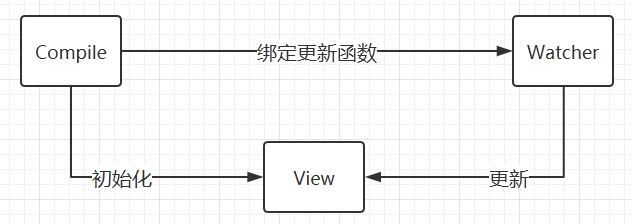
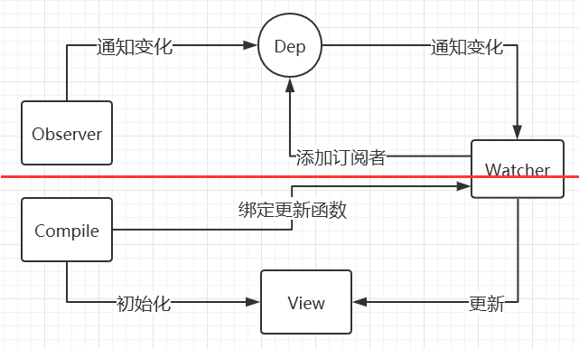

# 重新认识Vue：数据双向绑定（二）
> 上一部分分析了数据劫持和发布-订阅的原理，还差页面渲染，所以双向绑定还没有完成。之所以分开讲，是因为数据劫持和指令解析可以分开为两个部分，虽然他们最终通过Watcher得到了交互。  

网上的资料大多都是Observer、Watcher、Compile一起讲，长篇大论看起来挺吃力的，并且代码也有一定的复杂性，看的头晕。这次不复制粘贴代码，只写思路，因为代码我现在的水平很难写出来，就是复制过来了也是别人的，不如去看别人的文章~

所以这次我主要是把解析器Compile的实现思路写出来。

## Compile

### Compile的作用

上一篇文章并没有实现数据渲染到视图的功能，而Compile就是用来完成这个功能的。

### 实现Compile的步骤

第一步：解析模板指令，将模板中的变量替换成数据后渲染页面

第二步：每个指令对应的节点绑定更新函数，添加监听数据的订阅者

第三步：如果数据变动，订阅者收到通知后更新视图。

实现简单的解析器后，还需要实现指令解析功能。

#### 第一步：

1. 遍历创建MVVM对象时el绑定的节点的所有子节点，若是文本节点，则通过正则表达式判断是否有匹配{{XXX}}的项；

2. 通过Regexp.exec()取得{{}}里的数据：exp表达式（Regexp.exec()[1]），并将该文本节点中的exp表达式与初始化时的data里的数据比较，取得data[exp]的数据，替代节点node中{{XXX}}这一块。

#### 第二步：

使用new创建一个watcher对象，传递的参数是：MVVM对象this.vm，表达式exp，回调函数（用于更新节点中的表达式的值，参数是value和oldValue，oldValue应该就是MVVM框架中用于判断原来{{XXX}}存在的地方，只要把value替换oldValue就行了。）

#### 第三步：

数据变动后因为数据劫持，订阅器通知订阅者进行视图更新。于是watcher调用compile传递给watcher的回调函数，回调函数进行视图更新。

**至此，数据双向绑定完成**。

#### 指令解析：

上面的步骤只实现了{{XXX}}类型的数据双向绑定，但类似于v-model这种指令却没有实现。

实现指令的方式为：

之前遍历所有节点的时候，遍历节点的属性，如果属性中有指令属性，先区分是哪种指令属性，再调用相应的函数进行处理。

比如v-model，如果一个节点中有v-model，就可以绑定这个节点的value属性值为v-model里面表达式exp的值（data[exp]），其他操作更前面的绑定差不多。

## 总结MVVM数据双向绑定

我把数据双向绑定分为了两部分，分别对应数据双向绑定一和二两篇文章。而这个总的流程如下：

Observer数据监听（使用数据劫持），使得MVVM构造函数的实例对象中的数据变动时，可以通知订阅器Dep，订阅器通知所有的订阅者Watcher。

订阅者调用创建订阅者是Compile传递给订阅者的回调函数，这个回调函数用于替换表达式exp的旧值。

Compile完成最初的页面渲染，后面数据变动后的渲染交给Compile传递给订阅者的回调函数，订阅者触发回调函数达到视图更新的效果。