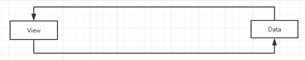
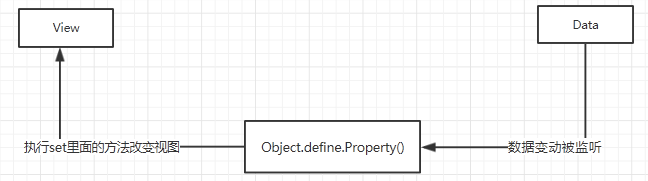
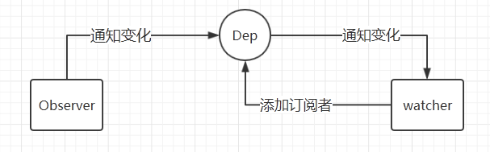

# 重新认识Vue：数据双向绑定（一）
> 数据双向绑定是MVVM框架的一大特点，也是现在学习这类框架必不可少的知识。

## 原理：

双向绑定无非就是，视图改变会导致数据改变，数据改变会导致视图改变。

在Vue中实现双向绑定用的是数据劫持，核心是Object.defineProperty方法。这个方法的作用是，请求数据时触发它设定的get方法，修改数据时触发它设定的set方法。总而言之，defineProperty方法的作用是监听数据的变化，并触发响应的代码。

使用defineProperty的操作流程：

这个过程叫实现一个**Observer**，实现监听器。虽然set里面的方法能够直接操作DOM，改变视图，但是我们应该把这个功能分离出来。

所以我们需要使用发布-订阅模式，在set方法里面通知订阅者需要修改视图。所以此时我们需要实现一个**Watcher**，订阅者。

有订阅者不够，需要有一个订阅器**Dep**。Dep的功能是：set方法通过Dep通知订阅者需要修改视图，同时能够添加订阅者。

到此为止，就在理论上实现了数据双向绑定的一大部分：监听到了数据的变化，通知到了所有的订阅者。还需要订阅者触发其他方法来更新视图，但这一块也比较麻烦，所以先分开讲。

## 实现Observer

	function defineReactive(data, key, val) {
	    observe(val); // 递归遍历所有子属性
	    Object.defineProperty(data, key, {
	        enumerable: true,
	        configurable: true,
	        get: function() {

			/*这里触发get方法，需要在这里添加订阅者*/

			return val;
	        },
	        set: function(newVal) {
			val = newVal

			/*这里触发set方法，需要在这里通知订阅者数据变动，更新视图*/
			
	        }
	    });
	}
	 
	function observe(data) {
	    if (!data || typeof data !== 'object') {
	        return;
	    }
	    Object.keys(data).forEach(function(key) {
	        defineReactive(data, key, data[key]);
	    });
	};

## 实现Dep和Watcher

	function defineReactive(data, key, val) {
	    observe(val); // 递归遍历所有子属性
	    var dep = new Dep(); 
	    Object.defineProperty(data, key, {
	        enumerable: true,
	        configurable: true,
	        get: function() {
	            if (是否需要添加订阅者) {
	                dep.addSub(watcher); // 在这里添加一个订阅者
	            }
	            return val;
	        },
	        set: function(newVal) {
	            if (val === newVal) {
	                return;
	            }
	            val = newVal;
	            dep.notify(); // 如果数据变化，通知所有订阅者
	        }
	    });
	}
	 
	function Dep () {
	    this.subs = [];
	}
	Dep.prototype = {
	    addSub: function(sub) {
	        this.subs.push(sub);
	    },
	    notify: function() {
	        this.subs.forEach(function(sub) {
	            sub.update();
	        });
	    }
	};
这里创建了一个构造函数Dep（订阅器），有两个方法，一个是增加订阅者方法addSub，一个是消息发布方法notify，前面都已经提过。

在数据劫持之前创建一个Dep对象，形成一个闭包。然后在get方法里面添加订阅者，在set方法里发布消息。

get方法添加订阅者有一个添加条件，不然每次取值都会添加订阅者。所以看下面的代码：

	function defineReactive(data, key, val) {
	    observe(val); // 递归遍历所有子属性
	    var dep = new Dep(); 
	    Object.defineProperty(data, key, {
	        enumerable: true,
	        configurable: true,
	        get: function() {
	            if (Dep.target) {.  // 判断是否需要添加订阅者
	                dep.addSub(Dep.target); // 在这里添加一个订阅者
	            }
	            return val;
	        },
	        set: function(newVal) {
	            if (val === newVal) {
	                return;
	            }
	            val = newVal;
	            console.log('属性' + key + '已经被监听了，现在值为：“' + newVal.toString() + '”');
	            dep.notify(); // 如果数据变化，通知所有订阅者
	        }
	    });
	}

	Dep.target = null;

	function Watcher(vm, exp, cb) {
	    this.cb = cb;
	    this.vm = vm;
	    this.exp = exp;
	    this.value = this.get();  // 将自己添加到订阅器的操作
	}
	 
	Watcher.prototype = {
	    update: function() {
	        this.run();
	    },
	    run: function() {
	        var value = this.vm.data[this.exp];
	        var oldVal = this.value;
	        if (value !== oldVal) {
	            this.value = value;
	            this.cb.call(this.vm, value, oldVal);
	        }
	    },
	    get: function() {
	        Dep.target = this;  // 缓存自己
	        var value = this.vm.data[this.exp]  // 强制执行监听器里的get函数
	        Dep.target = null;  // 释放自己
	        return value;
	    }
	};
现在只看Watcher的get方法：给Dep.target绑定自己，然后触发数据劫持的get方法，get方法里面判断Dep.target是否为null，不是的话就让订阅器添加订阅者（订阅者就是watcher对象）。然后再让Dep.target等于Null。

到此为止，数据监听和发布-订阅已经搞定了。接下来就需要一个解析器Compile，扫描和解析每个节点相关的指令，根据指令初始化模板数据和响应的订阅器。然后数据改变后订阅者调用某些方法去改变视图，达到双向绑定的效果了。