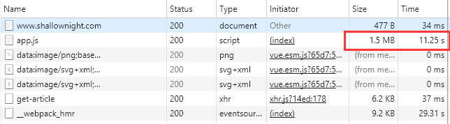
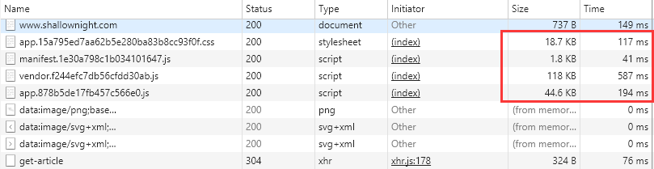
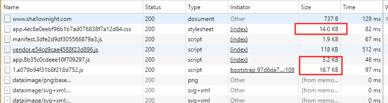
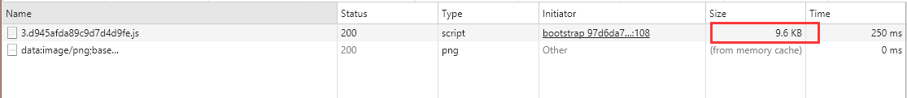

# 网站优化（一）
> 每次打开我的个人博客，都会感慨这速度简直奇慢无比。我心里隐隐知道原因，第一是图方便根本没有把Vue文件打包，第二则是云服务器配置低下。终于我对这个速度忍无可忍，决定来一次优化。  
> 这是第一次优化，性能优化，以后可能会加个响应式或者语义化什么的。

## 原始速度

啊哈！1.5MB的JS文件，下载11.25秒，也就是我打开个人博客需要11秒多！根本无法接受！

PS：之所有没有把Vue文件打包，是因为网站前期更新速度快，经常改，所以不想经常打包。现在更新速度慢下来了，是时候优化一下了！

## 打包并挂载到Express服务器

首先要创建一个Express服务器，最简单的就行，不需要弄个Express框架出来。

过程：

**安装Express**：

1. 先`npm init`创建一个package包；
2. 下载Express和中间件body-parser：`npm install express body-parser --save`；
3. 在项目根目录添加app.js来创建服务器。

**创建服务器**：

	/*app.js*/
	const express = require('express') 
	const path = require('path') 
	const app = express() 
	app.use(express.static(path.join(__dirname, 'dist'))) 
	app.listen(3000,() => { 
	 console.log('app listening on port 3000.') 
	})  

**Vue项目打包**：  
将Vue项目用`npm run build`打包，并把它放到app.js同级目录（根目录）。此时命令行在根目录运行`node app.js`即可打开挂载了Vue打包文件的Express服务器。

**小优化**：
在package文件的script里面可以加入指令来替代`node app.js`，例如：

    "scripts": {    
       "start": "node app.js"  
     },  

npm的start命令是一个特殊的脚本名称，因为在命令行中使用npm start就可以执行其对应的命令，如果对应的此脚本名称不是start，想要在命令行中运行时，需要这样用npm run {script name}如npm run build。

**结果**：

注意那几个JS文件是并行加载的，也就是说JS的加载只用了最多587ms，**速度提高了20倍**！

惊不惊喜，意不意外！！

## 路由懒加载

在尝试给网站进行优化前，还了解了一个东西：路由懒加载。

懒加载就是按需加载，本来Vue文件作为一个单页面网站，是一次性把所有JS都加载完了的。如果网站的文件较大，那么用户打开网站会花很多时间。

而应用路由懒加载后，这就使得Vue会按照路由按需加载。也就是一开始只加载当前页面的JS文件，改变URL时再加载下一个页面的JS文件。

本来以为会比较困难，结果挺简单的，改一改router文件就行了：

**原来的路由**：

	import Vue from 'vue'
	import Router from 'vue-router'
	import Home from '@/components/home'
	import Blog from '@/components/blog/blog'
	import Article from '@/components/blog/article'
	import Category from '@/components/category/category'
	import About from '@/components/about/about'
	import Timeaxis from '@/components/time/timeaxis'
	
	Vue.use(Router)
	
	export default new Router({
	  routes: [
	    {
	      path: '/',
	      name: 'Home',
	      component: Home,
	      children:[
	      	{ path: '/blog', component:Blog ,name:'主页'},
	        { path: '/article', component:Article ,name:'文章'},
	        { path: '/category', component:Category ,name:'分类'},
	        { path: '/about', component:About ,name:'关于'},
	        { path: '/timeaxis', component:Timeaxis ,name:'时间轴'}
	      ]
	    }
	  ]
	})

**懒加载之后的路由**：

	import Vue from 'vue'
	import Router from 'vue-router'
	import Home from '@/components/home'
	
	export default new Router({
	  routes: [
	    {
	      path: '/',
	      name: 'Home',
	      component: Home,
	      children:[
	        { path: '/blog', component:resolve =>require(['@/components/blog/blog'],resolve) ,name:'主页'},
	        { path: '/article', component:resolve =>require(['@/components/blog/article'],resolve) ,name:'文章'},
	        { path: '/category', component:resolve =>require(['@/components/category/category'],resolve) ,name:'分类'},
	        { path: '/about', component:resolve =>require(['@/components/about/about'],resolve),name:'关于'},
	        { path: '/timeaxis', component:resolve =>require(['@/components/time/timeaxis'],resolve),name:'时间轴'}
	      ]
	    }
	  ]
	})

其实就是组件里面由原本的组件变成了一个异步函数，调用该函数时才调用组件。

**效果对比**：

懒加载优化前：

懒加载优化后：

效果：  

1. css文件变小了！
2. app.xxx.js文件被拆分成了app.xxx.js和1.xxx.js，这个1.xxx.js则是当前页面的js文件。

**当跳转URL时，不进行懒加载的话是不会重新引入js文件的，但懒加载需要引入跳转的页面的js文件**：

**问题**：

懒加载可以使网站打开时只加载当前页面的内容，这样可以优化速度，但是如果整个Vue文件内容较少时，完全没有必要用到懒加载，而且懒加载对用户体验（流畅性）会有影响。

因为个人项目很小，所以即使实现了懒加载，也忍痛割爱把它给注释了……